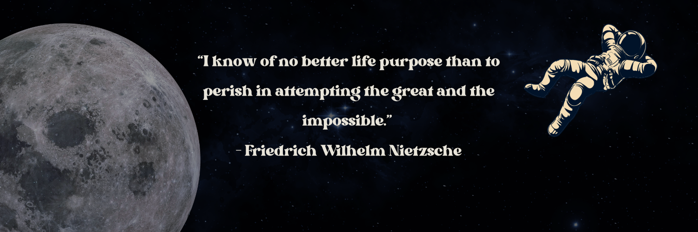

<h1 align="center">Hi 👋, I'm Santiago</h1>
<h3 align="center">A software engineering student from Colombia</h3>

- 🔭 I’m currently working on completing **CS50AI**

- 🌱 I’m currently learning about **Machine Learning**

- 🤝 I’m looking for help with **Neural Network Development**

- 💬 Ask me about **Machine Learning, REST APIs and Database Design**

- 📫 How to reach me **santiagoyepesmesa0224@gmail.com**

- ⚡ Fun fact **I love the gym and math stuff**

<h3 align="left">Connect with me:</h3>

<h3 align="left">Languages and Tools:</h3>

             

 

<h4><em><b>📝 Note</b></em></h4>
<b><em>The gif is a piece of a video belonging to <a href="https://www.youtube.com/watch?v=aircAruvnKk&list=PLZHQObOWTQDNU6R1_67000Dx_ZCJB-3pi&index=1" target="blank">3Blue1Brown</a></em></b>

